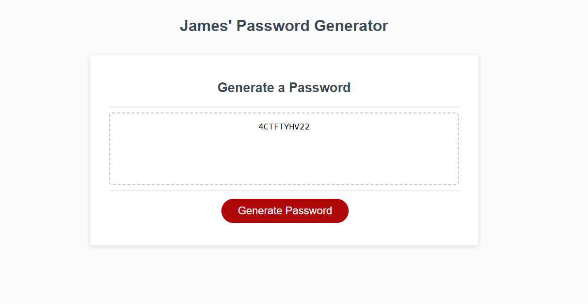

# password-generator-redux

## Description

James' Password Generator

This application generates passwords, this readme will detail how.

## Table of Contents

- [Screenshot](#screenshot)
- [Process](#process)
- [Build](#build)
- [Author](#author)

## Screenshot

## Process

I initialized and configured a new GitHub repo. The project is posted on GitHub pages so other can view it.

After cloning my repo and copying starter code into the new project, I had to add JS to complete the project. I established variables for upper and lower case letters and well as numbers and special characters. These were represented by "var chosenCharacter = "";"

The function starts with initializing the "result" and then prompts the user to choose a character length. Then the user confirms all character types and the password is generated in the box on screen. If the length falls outside of the 9-128 range an error will display.Once the function calls everything again, you will have to repeat the sequence again, until you meet the requirment: desired length has been chosen, choose a minimum of 1 out of 4 character options. Then the password will be generated and shown in the box.

## Build

-Starter code of HTML & CSS
-Javascript

## Author

-[My github](https://github.com/jamesbruckner)